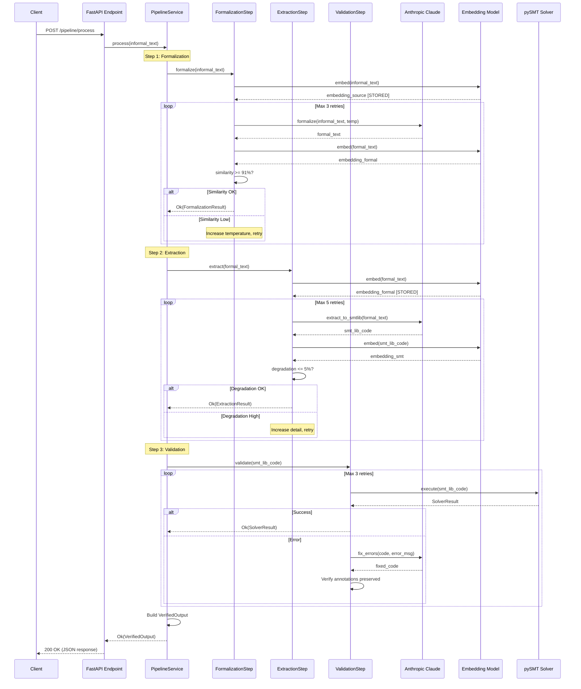
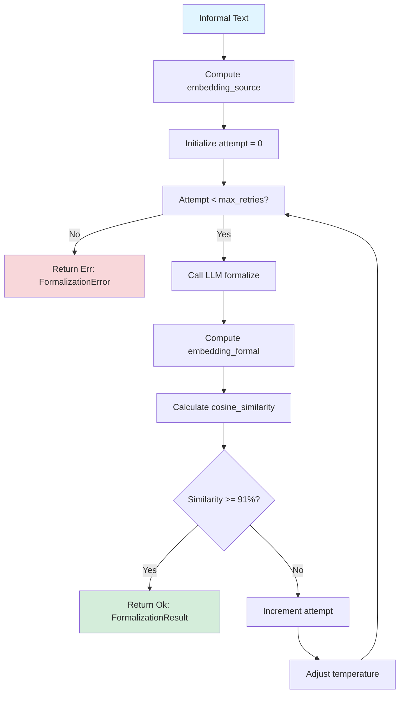
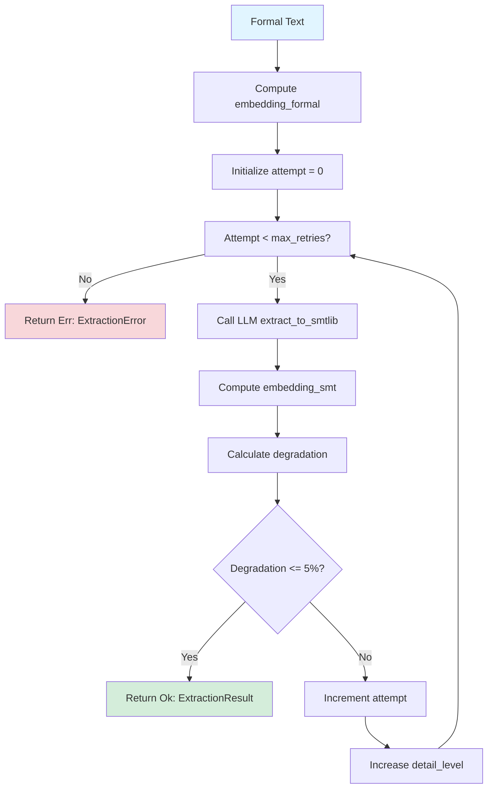
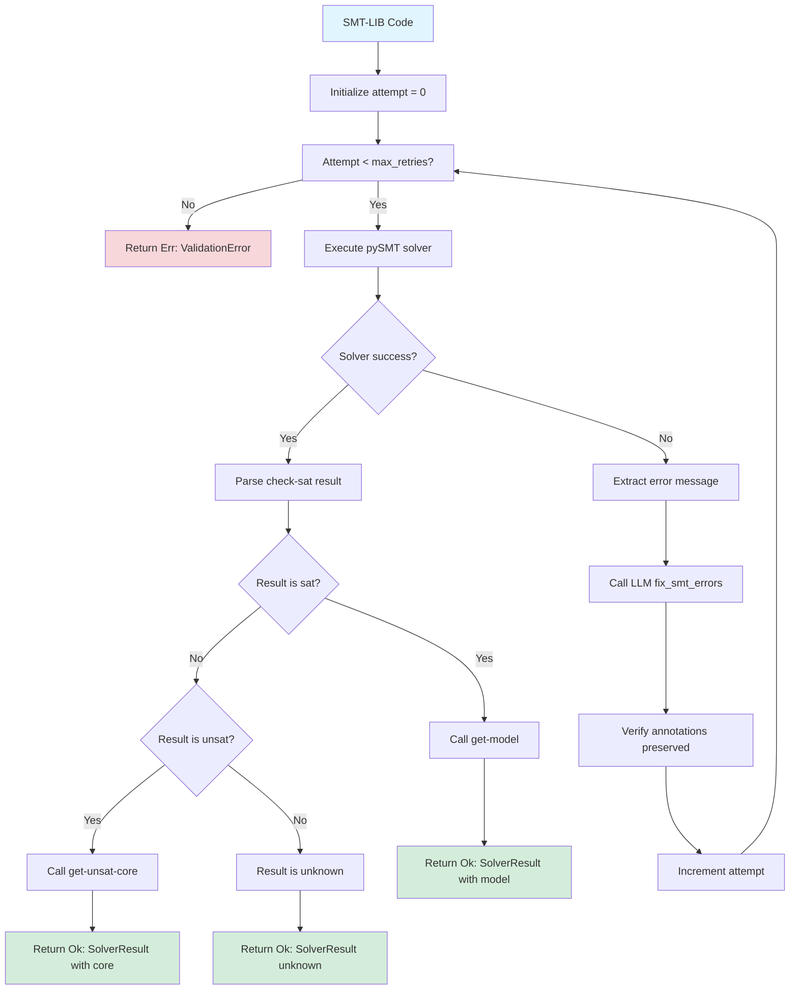
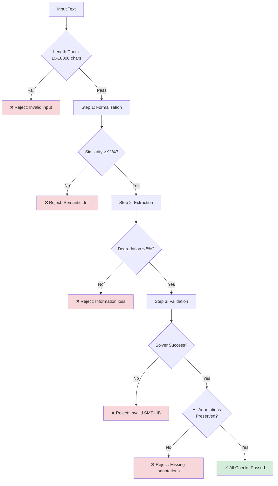

# Semantic-Preserving Text Formalization and SMT-LIB Extraction Pipeline Architecture

## Executive Summary

This document defines the technical architecture for a production-ready, semantic-preserving pipeline that transforms informal natural language text into valid, executable SMT-LIB symbolic representations. The system implements a three-step verification process (formalization, extraction, validation) with embedding distance metrics ensuring semantic completeness at each stage.

**Key Characteristics:**
- **Vertical Slice Architecture**: One complete end-to-end feature from API to verified SMT-LIB output
- **Type-Safe**: Full Python 3.11+ type annotations with Pydantic models throughout
- **Async/Await**: All I/O operations are non-blocking (LLM calls, embeddings, solver execution)
- **SOLID Principles**: Clean architecture with clear separation of concerns and dependency inversion
- **Production-Ready**: Comprehensive error handling, retry strategies, and quality gates

**Technology Stack:**
- Language: Python 3.11+ with strict type checking
- API Framework: FastAPI with async handlers
- LLM: Anthropic Claude Sonnet 4.5 via async HTTP client
- Embeddings: sentence-transformers/all-MiniLM-L6-v2 (local model)
- SMT Solver: pySMT (solver-agnostic SMT-LIB parser and execution framework)
- No persistence or caching layers (fresh processing per request)

**Validation Thresholds:**
- Step 1: Formalization similarity ≥91% (embedding distance verification)
- Step 2: Extraction degradation ≤5% (information completeness check)
- Step 3: Solver validation (executable SMT-LIB code)

---

## System Context

### Problem Statement

Current approaches to transforming natural language into formal symbolic representations suffer from:
1. **Semantic drift**: Formalization changes the original meaning
2. **Information loss**: Important facts or constraints are omitted during extraction
3. **Syntax errors**: Generated SMT-LIB code fails to execute with solvers
4. **No verification**: No automated way to detect completeness or correctness

### Solution Overview

Our pipeline addresses these issues through a three-step process with automated verification at each stage:


### System Boundaries

**In Scope:**
- Processing single informal text inputs via REST API
- Three-step pipeline orchestration with retry logic
- Embedding distance calculations for semantic verification
- SMT solver execution and error correction
- Complete output with check-sat result, model/unsat-core, and annotated code

**Out of Scope:**
- Persistence layer (all processing is stateless)
- Caching mechanisms (fresh processing per request)
- Multiple LLM provider support (Anthropic Claude only)
- Batch processing or streaming (single request/response)
- Web UI or interactive interfaces

### Vertical Slice Focus

This architecture implements ONE complete use case:

**"Process informal text to verified SMT-LIB output"**

The vertical slice cuts through all layers:
- **API Layer**: POST /pipeline/process endpoint
- **Application Layer**: PipelineService orchestration
- **Domain Layer**: Formalization, extraction, validation logic
- **Infrastructure Layer**: LLM client, embeddings, SMT solver execution

We build only what's necessary for this slice to work end-to-end, avoiding speculative features or premature abstractions.

---

## Architectural Principles

### 1. SOLID Principles Applied

#### Single Responsibility Principle (SRP)
**Why**: Each class/module should have one reason to change, making the system easier to understand and modify.

**Application:**
- `FormalizationStep`: Only handles text formalization and similarity verification
- `ExtractionStep`: Only handles SMT-LIB extraction and degradation verification
- `ValidationStep`: Only handles solver execution and error correction
- `EmbeddingVerifier`: Only calculates embedding distances
- `AnthropicClient`: Only communicates with Anthropic API
- `PysmtExecutor`: Only executes SMT solver via pySMT

**Anti-pattern Avoided**: Monolithic "PipelineProcessor" class that does everything.

#### Open/Closed Principle (OCP)
**Why**: System should be open for extension but closed for modification.

**Application:**
- Protocol-based interfaces allow swapping implementations without changing consumers
- New LLM providers can be added by implementing `LLMProvider` protocol
- New SMT solvers can be added by implementing `SMTSolver` protocol
- New verification strategies can be added by implementing `SemanticVerifier` protocol

**Example:**
```python
class LLMProvider(Protocol):
    """Protocol allows extending to GPT-4, Gemini, etc. without changing pipeline."""
    async def formalize(self, informal_text: str, temperature: float) -> str: ...
    async def extract_to_smtlib(self, formal_text: str, detail_level: float) -> str: ...
    async def fix_smt_errors(self, smt_code: str, error_message: str) -> str: ...
```

#### Liskov Substitution Principle (LSP)
**Why**: Any implementation of an interface should be substitutable without breaking behavior.

**Application:**
- All `LLMProvider` implementations must respect the same contracts
- All `SMTSolver` implementations return the same `SolverResult` structure
- Testing uses mock implementations that are true substitutes

**Constraint**: We avoid inheritance hierarchies in favor of Protocol composition, making LSP violations less likely.

#### Interface Segregation Principle (ISP)
**Why**: Clients should not depend on interfaces they don't use.

**Application:**
- Separate protocols for different concerns:
  - `LLMProvider` for LLM interactions
  - `EmbeddingProvider` for embedding generation
  - `SMTSolver` for solver execution
  - `SemanticVerifier` for embedding distance calculations
- Each protocol is minimal and focused

**Anti-pattern Avoided**: Monolithic "ExternalServicesInterface" with 20 methods.

#### Dependency Inversion Principle (DIP)
**Why**: Depend on abstractions (protocols), not concretions (classes).

**Application:**
- `PipelineService` depends on `LLMProvider` protocol, not `AnthropicClient` class
- `FormalizationStep` depends on `EmbeddingProvider` protocol, not `SentenceTransformerProvider` class
- FastAPI dependency injection wires concrete implementations at runtime

**Example:**
```python
class PipelineService:
    """Depends on abstractions, not concrete implementations."""

    def __init__(
        self,
        embedding_provider: EmbeddingProvider,  # Protocol, not class
        llm_provider: LLMProvider,              # Protocol, not class
        smt_solver: SMTSolver                   # Protocol, not class
    ):
        self.embedding_provider = embedding_provider
        self.llm_provider = llm_provider
        self.smt_solver = smt_solver
```

### 2. DRY (Don't Repeat Yourself)

**Why**: Duplication increases maintenance burden and introduces inconsistency risks.

**Application:**
- Retry logic abstracted into reusable `retry_with_backoff` decorator
- Embedding distance calculation centralized in `EmbeddingVerifier`
- Result type pattern used consistently for error handling
- LLM prompt templates stored in single `prompts.py` module

**Critical Optimization (from specification):**
```python
# GOOD: Compute source embedding ONCE, reuse in retry loop
embedding_source = await embedding_provider.embed(informal_text)
for attempt in range(max_retries):
    formal_text = await llm.formalize(informal_text, temperature=...)
    embedding_formal = await embedding_provider.embed(formal_text)
    similarity = cosine_similarity(embedding_source, embedding_formal)

# BAD: Re-compute source embedding every iteration (wasteful)
for attempt in range(max_retries):
    embedding_source = await embedding_provider.embed(informal_text)  # Duplicated work
    embedding_formal = await embedding_provider.embed(formal_text)
```

### 3. KISS (Keep It Simple, Stupid)

**Why**: Simple solutions are easier to understand, test, and maintain.

**Application:**
- No complex orchestration frameworks (use plain async functions)
- No elaborate caching mechanisms (process fresh each time)
- No premature abstractions (build only what the vertical slice needs)
- Use pySMT library for solver-agnostic SMT-LIB parsing and execution

**Example of Simplicity:**
```python
# Simple, direct approach using pySMT
from pysmt.shortcuts import Solver
from pysmt.smtlib.parser import SmtLibParser

async def execute_solver(self, code: str) -> SolverResult:
    parser = SmtLibParser()
    script = parser.get_script(code)
    formula = script.get_last_formula()

    with Solver() as solver:
        solver.add_assertion(formula)
        result = solver.solve()
        return self._create_result(result, solver)

# Over-engineered alternative (AVOIDED)
# - Complex solver factory pattern
# - Custom SMT-LIB parser implementation
# - Multi-stage result post-processing pipeline
```

### 4. YAGNI (You Aren't Gonna Need It)

**Why**: Building features before they're needed wastes effort and adds complexity.

**What We DON'T Build:**
- Persistence layer (not needed for vertical slice)
- Caching layer (not needed for vertical slice)
- Multiple LLM provider support (only Anthropic needed now)
- Batch processing APIs (single request/response sufficient)
- Admin dashboards or monitoring UIs (logging sufficient)
- Complex webhook systems (synchronous request/response sufficient)

**What We DO Build:**
- Exactly what's needed for the vertical slice to work
- Extension points (protocols) for future needs
- Clear interfaces that make future additions easy

### 5. TRIZ (Theory of Inventive Problem Solving)

**Why**: Understanding constraints and contradictions leads to better architectural decisions.

**Contradictions Resolved:**

1. **Performance vs. Accuracy**
   - Contradiction: Fast processing vs. high-quality LLM outputs
   - Resolution: Store embeddings in variables (33-40% reduction in embedding computations), use async I/O to parallelize when possible

2. **Simplicity vs. Extensibility**
   - Contradiction: Keep code simple (KISS) vs. allow future extensions (OCP)
   - Resolution: Use protocols for interfaces (simple to understand, easy to extend), avoid complex inheritance hierarchies

3. **Type Safety vs. Flexibility**
   - Contradiction: Strict typing (catch errors early) vs. flexible data handling
   - Resolution: Pydantic models with validation (type safety + runtime validation + easy JSON serialization)

4. **Error Handling vs. Code Clarity**
   - Contradiction: Comprehensive error handling vs. readable code
   - Resolution: Result types for expected failures (explicit, no hidden control flow), exceptions for unexpected failures

---

## Module Design

### Directory Structure

```
src/
├── api/                          # API Layer (FastAPI)
│   ├── __init__.py
│   ├── dependencies.py           # Dependency injection container
│   ├── models.py                 # Request/Response Pydantic models
│   └── routes/
│       ├── __init__.py
│       └── pipeline.py           # POST /pipeline/process endpoint
│
├── application/                  # Application/Service Layer
│   ├── __init__.py
│   ├── pipeline_service.py       # Orchestrates 3-step pipeline
│   └── exceptions.py             # Application-level exceptions
│
├── domain/                       # Domain/Business Logic Layer
│   ├── __init__.py
│   ├── models.py                 # Domain models (VerifiedOutput, PipelineMetrics)
│   ├── interfaces.py             # Protocols/ABCs for dependency inversion
│   ├── steps/
│   │   ├── __init__.py
│   │   ├── formalization.py      # Step 1: Formalization logic
│   │   ├── extraction.py         # Step 2: SMT-LIB extraction logic
│   │   └── validation.py         # Step 3: Solver validation logic
│   └── verification/
│       ├── __init__.py
│       └── embedding_verifier.py # Embedding distance calculations
│
├── infrastructure/               # Infrastructure/External Dependencies
│   ├── __init__.py
│   ├── llm/
│   │   ├── __init__.py
│   │   ├── client.py             # Anthropic Claude async client
│   │   └── prompts.py            # LLM prompt templates
│   ├── embeddings/
│   │   ├── __init__.py
│   │   └── sentence_transformer.py  # Embedding model wrapper
│   └── smt/
│       ├── __init__.py
│       └── pysmt_executor.py     # pySMT solver execution wrapper
│
├── shared/                       # Shared utilities
│   ├── __init__.py
│   ├── result.py                 # Result<T, E> type for error handling
│   ├── retry.py                  # Retry decorator with backoff
│   ├── logging_config.py         # Structured logging setup
│   └── config.py                 # Pydantic Settings for configuration
│
└── main.py                       # FastAPI application entry point
```

### Module Responsibilities

#### API Layer (`src/api/`)

**Responsibility**: HTTP interface to the outside world.

**Why this layer exists**: Isolates web framework concerns (FastAPI) from business logic. Makes it possible to swap FastAPI for another framework without changing domain code.

**Key files:**

1. **`api/models.py`** - Request/Response Pydantic models
   - `ProcessRequest`: API request model
   - `ProcessResponse`: API response model
   - Handles JSON serialization/deserialization
   - Validates input constraints (e.g., text length limits)

2. **`api/routes/pipeline.py`** - HTTP endpoint handlers
   - `POST /pipeline/process`: Main pipeline endpoint
   - Converts HTTP requests to domain operations
   - Converts domain results to HTTP responses
   - Maps domain exceptions to HTTP status codes

3. **`api/dependencies.py`** - Dependency injection
   - FastAPI dependency providers
   - Wires concrete implementations to protocols
   - Manages singleton instances (LLM client, embedding model)

**Design decisions:**
- API models are separate from domain models (different validation rules)
- Endpoint handlers are thin (delegate to application layer immediately)
- No business logic in this layer (pure translation)

#### Application Layer (`src/application/`)

**Responsibility**: Orchestrates domain operations and manages application flow.

**Why this layer exists**: Coordinates multiple domain operations without containing domain logic itself. Think of it as the "use case" layer.

**Key files:**

1. **`application/pipeline_service.py`** - Main orchestrator
   - Coordinates the three-step pipeline
   - Manages retry loops with stored embeddings
   - Collects metrics across all steps
   - Builds final `VerifiedOutput` response

2. **`application/exceptions.py`** - Application exceptions
   - `PipelineError` (base exception)
   - `FormalizationError` (Step 1 failure)
   - `ExtractionError` (Step 2 failure)
   - `ValidationError` (Step 3 failure)

**Design decisions:**
- Service depends on domain protocols, not infrastructure classes
- No framework dependencies (can be tested without FastAPI)
- Pure async functions (no blocking I/O)

#### Domain Layer (`src/domain/`)

**Responsibility**: Core business logic and domain models.

**Why this layer exists**: Contains the essential complexity of the problem domain. This is the most important layer - it should change only when business requirements change.

**Key files:**

1. **`domain/models.py`** - Domain models (Pydantic)
   - `FormalizationResult`: Output of Step 1
   - `ExtractionResult`: Output of Step 2
   - `SolverResult`: Output of Step 3
   - `VerifiedOutput`: Final pipeline output
   - `PipelineMetrics`: Performance and quality metrics
   - All use strict Pydantic validation

2. **`domain/interfaces.py`** - Protocols (abstractions)
   - `LLMProvider`: LLM interaction interface
   - `EmbeddingProvider`: Embedding generation interface
   - `SMTSolver`: Solver execution interface
   - `SemanticVerifier`: Embedding distance calculation interface

3. **`domain/steps/formalization.py`** - Step 1 logic
   - Formalization retry loop with similarity check
   - Stores source embedding in variable (compute once)
   - Adjusts temperature on retries
   - Returns `Result[FormalizationResult, FormalizationError]`

4. **`domain/steps/extraction.py`** - Step 2 logic
   - Extraction retry loop with degradation check
   - Stores formal text embedding in variable (compute once)
   - Increases detail level on retries
   - Returns `Result[ExtractionResult, ExtractionError]`

5. **`domain/steps/validation.py`** - Step 3 logic
   - Solver execution retry loop
   - LLM-based error correction
   - Verifies annotations preserved after fixes
   - Returns `Result[SolverResult, ValidationError]`

6. **`domain/verification/embedding_verifier.py`** - Semantic verification
   - Cosine similarity calculation
   - Degradation computation
   - Centralized embedding distance logic

**Design decisions:**
- No infrastructure dependencies (depends only on protocols)
- Pure functions where possible (easier to test)
- Result types for expected failures (explicit error handling)
- Immutable domain models (Pydantic frozen models where appropriate)

#### Infrastructure Layer (`src/infrastructure/`)

**Responsibility**: Implements interfaces for external systems (LLM, embeddings, solver).

**Why this layer exists**: Isolates external dependencies so they can be swapped or mocked without changing domain logic.

**Key files:**

1. **`infrastructure/llm/client.py`** - Anthropic Claude client
   - Async HTTP client for Anthropic API
   - Implements `LLMProvider` protocol
   - Handles retries, timeouts, rate limiting
   - Logs all requests/responses

2. **`infrastructure/llm/prompts.py`** - LLM prompt templates
   - Formalization prompts
   - Extraction prompts (with annotation instructions)
   - Error fixing prompts
   - Centralized prompt management

3. **`infrastructure/embeddings/sentence_transformer.py`** - Embedding provider
   - Loads sentence-transformers model
   - Implements `EmbeddingProvider` protocol
   - Runs in thread pool to avoid blocking event loop
   - Caches model instance (singleton)

4. **`infrastructure/smt/pysmt_executor.py`** - pySMT solver executor
   - Uses pySMT for SMT-LIB parsing and execution
   - Implements `SMTSolver` protocol
   - Parses solver output (sat/unsat/unknown)
   - Extracts models and unsat cores
   - Handles timeouts and errors
   - Solver-agnostic (works with any pySMT-supported backend)

**Design decisions:**
- Each infrastructure component is independent (can be developed/tested separately)
- All implement domain protocols (dependency inversion)
- All use async I/O (non-blocking)
- Extensive logging for debugging external integrations

#### Shared Layer (`src/shared/`)

**Responsibility**: Cross-cutting concerns and utilities.

**Key files:**

1. **`shared/result.py`** - Result type for error handling
2. **`shared/retry.py`** - Retry decorator with exponential backoff
3. **`shared/logging_config.py`** - Structured logging setup
4. **`shared/config.py`** - Pydantic Settings (environment configuration)

**Design decisions:**
- No business logic in shared utilities
- All utilities are pure/side-effect-free where possible
- Logging is structured (JSON format for production)

---

## Data Flow

### High-Level Pipeline Flow



### Detailed Step 1: Formalization



**Critical Optimization**: `embedding_source` is computed ONCE before the loop and reused in all iterations. Only `embedding_formal` is computed per attempt.

**Performance Impact**:
- 3 retries: 4 embeddings instead of 6 (33% reduction)
- Each embedding: ~100-200ms
- Total savings: 200-400ms per formalization

### Detailed Step 2: Extraction



**Critical Optimization**: `embedding_formal` is computed ONCE before the loop and reused in all iterations. Only `embedding_smt` is computed per attempt.

**Performance Impact**:
- 5 retries: 6 embeddings instead of 10 (40% reduction)
- Each embedding: ~100-200ms
- Total savings: 400-800ms per extraction

### Detailed Step 3: Validation



**No Embedding Optimization**: Step 3 doesn't use embeddings, only solver execution. Optimization is in parallel async I/O for solver execution.

---

## Type System

### Core Domain Models

All domain models use Pydantic for runtime validation, JSON serialization, and type safety.

```python
from pydantic import BaseModel, Field, ConfigDict
from typing import Optional, Literal
from enum import Enum

# ============================================================================
# Step 1: Formalization Models
# ============================================================================

class FormalizationResult(BaseModel):
    """Result from Step 1: Formalization."""

    formal_text: str = Field(
        description="Formalized version of informal text"
    )
    similarity_score: float = Field(
        ge=0.0,
        le=1.0,
        description="Cosine similarity between informal and formal embeddings"
    )
    attempts: int = Field(
        ge=1,
        le=3,
        description="Number of attempts required to achieve threshold"
    )

    model_config = ConfigDict(frozen=True)  # Immutable


# ============================================================================
# Step 2: Extraction Models
# ============================================================================

class ExtractionResult(BaseModel):
    """Result from Step 2: SMT-LIB Extraction."""

    smt_lib_code: str = Field(
        description="Complete annotated SMT-LIB file (code + comments)"
    )
    degradation: float = Field(
        ge=0.0,
        le=1.0,
        description="Information degradation from formal text to SMT-LIB"
    )
    attempts: int = Field(
        ge=1,
        le=5,
        description="Number of attempts required to achieve threshold"
    )

    model_config = ConfigDict(frozen=True)


# ============================================================================
# Step 3: Validation Models
# ============================================================================

class CheckSatResult(str, Enum):
    """Possible check-sat results from SMT solver."""
    SAT = "sat"
    UNSAT = "unsat"
    UNKNOWN = "unknown"


class SolverResult(BaseModel):
    """Result from Step 3: SMT Solver Validation."""

    success: bool = Field(
        description="Whether solver executed without errors"
    )
    check_sat_result: str = Field(
        description="Result from (check-sat): sat, unsat, unknown, or error message"
    )
    model: Optional[str] = Field(
        default=None,
        description="Variable assignments from (get-model) if sat"
    )
    unsat_core: Optional[str] = Field(
        default=None,
        description="Minimal unsatisfiable subset from (get-unsat-core) if unsat"
    )
    raw_output: str = Field(
        description="Complete raw output from solver"
    )
    attempts: int = Field(
        ge=1,
        le=3,
        description="Number of attempts required (including error fixes)"
    )

    model_config = ConfigDict(frozen=True)


# ============================================================================
# Pipeline Metrics
# ============================================================================

class PipelineMetrics(BaseModel):
    """Performance and quality metrics for the entire pipeline."""

    # Step 1
    formalization_attempts: int = Field(ge=1, le=3)
    final_formalization_similarity: float = Field(ge=0.0, le=1.0)
    formalization_time_seconds: float = Field(ge=0.0)

    # Step 2
    extraction_attempts: int = Field(ge=1, le=5)
    final_extraction_degradation: float = Field(ge=0.0, le=1.0)
    extraction_time_seconds: float = Field(ge=0.0)

    # Step 3
    validation_attempts: int = Field(ge=1, le=3)
    solver_execution_time_seconds: float = Field(ge=0.0)

    # Overall
    total_time_seconds: float = Field(ge=0.0)
    success: bool

    model_config = ConfigDict(frozen=True)


# ============================================================================
# Final Output
# ============================================================================

class VerifiedOutput(BaseModel):
    """Complete verified output from the pipeline."""

    # Original input
    informal_text: str = Field(
        description="Original informal natural language text"
    )

    # Step 1 output
    formal_text: str = Field(
        description="Formalized version with preserved semantics"
    )
    formalization_similarity: float = Field(
        ge=0.0,
        le=1.0,
        description="Embedding similarity score (≥0.91 required)"
    )

    # Step 2 output
    smt_lib_code: str = Field(
        description="Complete annotated SMT-LIB code (executable)"
    )
    extraction_degradation: float = Field(
        ge=0.0,
        le=1.0,
        description="Information degradation score (≤0.05 required)"
    )

    # Step 3 output
    check_sat_result: str = Field(
        description="Result from SMT solver: sat, unsat, or unknown"
    )
    model: Optional[str] = Field(
        default=None,
        description="Model (variable assignments) if sat"
    )
    unsat_core: Optional[str] = Field(
        default=None,
        description="Unsat core (conflicting constraints) if unsat"
    )
    solver_success: bool = Field(
        description="Whether solver executed successfully"
    )

    # Metrics
    metrics: PipelineMetrics = Field(
        description="Performance and quality metrics"
    )

    # Quality gates
    passed_all_checks: bool = Field(
        description="Whether all quality thresholds were met"
    )
    requires_manual_review: bool = Field(
        description="Whether manual review is recommended"
    )

    model_config = ConfigDict(frozen=False)  # Mutable for building up


# ============================================================================
# API Models (separate from domain models)
# ============================================================================

class ProcessRequest(BaseModel):
    """API request for pipeline processing."""

    informal_text: str = Field(
        min_length=10,
        max_length=10000,
        description="Informal natural language text to process"
    )

    # Optional parameters
    get_model: bool = Field(
        default=True,
        description="Whether to retrieve model if sat"
    )
    get_unsat_core: bool = Field(
        default=False,
        description="Whether to retrieve unsat core if unsat"
    )


class ProcessResponse(BaseModel):
    """API response for pipeline processing."""

    # Copy all fields from VerifiedOutput
    informal_text: str
    formal_text: str
    formalization_similarity: float
    smt_lib_code: str
    extraction_degradation: float
    check_sat_result: str
    model: Optional[str]
    unsat_core: Optional[str]
    solver_success: bool
    metrics: PipelineMetrics
    passed_all_checks: bool
    requires_manual_review: bool

    @classmethod
    def from_domain(cls, output: VerifiedOutput) -> "ProcessResponse":
        """Convert domain model to API response."""
        return cls(
            informal_text=output.informal_text,
            formal_text=output.formal_text,
            formalization_similarity=output.formalization_similarity,
            smt_lib_code=output.smt_lib_code,
            extraction_degradation=output.extraction_degradation,
            check_sat_result=output.check_sat_result,
            model=output.model,
            unsat_core=output.unsat_core,
            solver_success=output.solver_success,
            metrics=output.metrics,
            passed_all_checks=output.passed_all_checks,
            requires_manual_review=output.requires_manual_review
        )
```

### Result Type for Error Handling

**Why Result types**: Explicit error handling without exceptions for control flow. Makes success/failure paths visible in type signatures.

```python
from typing import TypeVar, Generic, Union
from dataclasses import dataclass

T = TypeVar('T')
E = TypeVar('E', bound=Exception)

@dataclass(frozen=True)
class Ok(Generic[T]):
    """Successful result containing a value."""
    value: T

    def is_ok(self) -> bool:
        return True

    def is_err(self) -> bool:
        return False

    def unwrap(self) -> T:
        """Get the value (safe because this is Ok)."""
        return self.value

    def unwrap_or(self, default: T) -> T:
        """Get the value or default (returns value)."""
        return self.value


@dataclass(frozen=True)
class Err(Generic[E]):
    """Failed result containing an error."""
    error: E

    def is_ok(self) -> bool:
        return False

    def is_err(self) -> bool:
        return True

    def unwrap(self) -> T:
        """Get the value (raises because this is Err)."""
        raise self.error

    def unwrap_or(self, default: T) -> T:
        """Get the value or default (returns default)."""
        return default


Result = Union[Ok[T], Err[E]]


# Usage example with pattern matching (Python 3.10+)
async def example_usage(text: str) -> None:
    result = await formalization_step.formalize(text)

    match result:
        case Ok(formalization):
            print(f"Success! Similarity: {formalization.similarity_score}")
            # Continue with extraction
        case Err(error):
            print(f"Failed: {error}")
            # Handle error
```

**Type Safety Benefits**:
- Forces handling of both success and failure cases
- No hidden exceptions in control flow
- Type checker verifies all paths handled
- Self-documenting (signature shows what can go wrong)

---

## Error Handling Strategy

### Exception Hierarchy

```python
class PipelineError(Exception):
    """Base exception for all pipeline errors."""
    pass


class FormalizationError(PipelineError):
    """Step 1 failed to preserve semantics within threshold."""

    def __init__(
        self,
        message: str,
        attempts: int,
        final_similarity: float,
        threshold: float = 0.91
    ):
        super().__init__(message)
        self.attempts = attempts
        self.final_similarity = final_similarity
        self.threshold = threshold

    def __str__(self) -> str:
        return (
            f"Formalization failed after {self.attempts} attempts. "
            f"Final similarity: {self.final_similarity:.2%} "
            f"(threshold: {self.threshold:.2%})"
        )


class ExtractionError(PipelineError):
    """Step 2 failed to extract complete information within threshold."""

    def __init__(
        self,
        message: str,
        attempts: int,
        final_degradation: float,
        threshold: float = 0.05
    ):
        super().__init__(message)
        self.attempts = attempts
        self.final_degradation = final_degradation
        self.threshold = threshold

    def __str__(self) -> str:
        return (
            f"Extraction failed after {self.attempts} attempts. "
            f"Final degradation: {self.final_degradation:.2%} "
            f"(threshold: {self.threshold:.2%})"
        )


class ValidationError(PipelineError):
    """Step 3 failed to produce valid executable SMT-LIB."""

    def __init__(
        self,
        message: str,
        attempts: int,
        final_error: str
    ):
        super().__init__(message)
        self.attempts = attempts
        self.final_error = final_error

    def __str__(self) -> str:
        return (
            f"Validation failed after {self.attempts} attempts. "
            f"Final error: {self.final_error}"
        )


class LLMError(PipelineError):
    """LLM API call failed."""

    def __init__(self, message: str, status_code: Optional[int] = None):
        super().__init__(message)
        self.status_code = status_code


class EmbeddingError(PipelineError):
    """Embedding generation failed."""
    pass


class SolverExecutionError(PipelineError):
    """SMT solver execution failed unexpectedly."""

    def __init__(self, message: str, stderr: str):
        super().__init__(message)
        self.stderr = stderr
```

### Error Handling Patterns

**1. Expected Failures → Result Types**

Use `Result[T, E]` for failures that are part of normal operation:
- Formalization doesn't meet similarity threshold
- Extraction has too much degradation
- Solver returns syntax errors

```python
async def formalize(
    self,
    informal_text: str
) -> Result[FormalizationResult, FormalizationError]:
    """
    Returns Result type because failure is expected and handled.
    Caller must explicitly handle both Ok and Err cases.
    """
    try:
        embedding_source = await self.embedding_provider.embed(informal_text)

        for attempt in range(self.max_retries):
            formal_text = await self.llm_provider.formalize(
                informal_text,
                temperature=0.3 + attempt * 0.1
            )

            embedding_formal = await self.embedding_provider.embed(formal_text)
            similarity = self.verifier.cosine_similarity(
                embedding_source,
                embedding_formal
            )

            if similarity >= self.threshold:
                return Ok(FormalizationResult(
                    formal_text=formal_text,
                    similarity_score=similarity,
                    attempts=attempt + 1
                ))

        # All retries exhausted
        return Err(FormalizationError(
            message="Failed to preserve semantics",
            attempts=self.max_retries,
            final_similarity=similarity
        ))

    except Exception as e:
        # Unexpected errors still raise exceptions
        raise PipelineError(f"Unexpected error in formalization: {e}") from e
```

**2. Unexpected Failures → Exceptions**

Use exceptions for failures that indicate bugs or infrastructure problems:
- Network failures
- Invalid configuration
- Programming errors

```python
async def embed(self, text: str) -> np.ndarray:
    """
    Raises exception because embedding failure is unexpected.
    Indicates infrastructure problem (model not loaded, OOM, etc.).
    """
    try:
        loop = asyncio.get_event_loop()
        embedding = await loop.run_in_executor(
            None,
            self._compute_embedding,
            text
        )
        return embedding
    except Exception as e:
        raise EmbeddingError(
            f"Failed to compute embedding for text (length={len(text)}): {e}"
        ) from e
```

**3. Retry Logic**

```python
from functools import wraps
import asyncio
from typing import TypeVar, Callable, Awaitable

T = TypeVar('T')

def retry_with_backoff(
    max_attempts: int = 3,
    initial_delay: float = 1.0,
    backoff_factor: float = 2.0,
    exceptions: tuple[type[Exception], ...] = (Exception,)
):
    """
    Decorator for retrying async functions with exponential backoff.

    Args:
        max_attempts: Maximum number of retry attempts
        initial_delay: Initial delay in seconds
        backoff_factor: Multiplier for delay on each retry
        exceptions: Tuple of exception types to catch and retry
    """
    def decorator(func: Callable[..., Awaitable[T]]) -> Callable[..., Awaitable[T]]:
        @wraps(func)
        async def wrapper(*args, **kwargs) -> T:
            delay = initial_delay
            last_exception: Optional[Exception] = None

            for attempt in range(max_attempts):
                try:
                    return await func(*args, **kwargs)
                except exceptions as e:
                    last_exception = e
                    if attempt < max_attempts - 1:
                        await asyncio.sleep(delay)
                        delay *= backoff_factor
                    else:
                        raise

            # Should never reach here, but for type safety
            if last_exception:
                raise last_exception
            raise RuntimeError("Retry logic failed unexpectedly")

        return wrapper
    return decorator


# Usage
class AnthropicClient:
    @retry_with_backoff(
        max_attempts=3,
        initial_delay=1.0,
        exceptions=(httpx.HTTPError, httpx.TimeoutException)
    )
    async def formalize(
        self,
        informal_text: str,
        temperature: float = 0.3
    ) -> str:
        """Formalize text with automatic retry on network errors."""
        async with httpx.AsyncClient(timeout=30.0) as client:
            response = await client.post(
                "https://api.anthropic.com/v1/messages",
                headers=self._get_headers(),
                json=self._build_formalization_request(informal_text, temperature)
            )
            response.raise_for_status()
            return self._parse_response(response.json())
```

---

## Interface Definitions

### Protocols for Dependency Inversion

**Why protocols**: Duck typing with type checking. Avoids inheritance hierarchies while maintaining type safety.

```python
from typing import Protocol, runtime_checkable
import numpy as np
import numpy.typing as npt

# ============================================================================
# Embedding Provider Protocol
# ============================================================================

@runtime_checkable
class EmbeddingProvider(Protocol):
    """
    Protocol for generating text embeddings.

    Implementations:
    - SentenceTransformerProvider (local model)
    - OpenAIEmbeddingProvider (API-based, future)
    """

    async def embed(self, text: str) -> npt.NDArray[np.float32]:
        """
        Generate embedding vector for text.

        Args:
            text: Input text to embed

        Returns:
            Numpy array of shape (embedding_dim,) with dtype float32

        Raises:
            EmbeddingError: If embedding generation fails
        """
        ...


# ============================================================================
# LLM Provider Protocol
# ============================================================================

@runtime_checkable
class LLMProvider(Protocol):
    """
    Protocol for LLM interactions.

    Implementations:
    - AnthropicClient (Claude Sonnet)
    - OpenAIClient (GPT-4, future)
    """

    async def formalize(
        self,
        informal_text: str,
        temperature: float = 0.3
    ) -> str:
        """
        Transform informal text to formal text.

        Args:
            informal_text: Source natural language text
            temperature: Sampling temperature (0.0-1.0)

        Returns:
            Formalized text with explicit facts and rules

        Raises:
            LLMError: If API call fails
        """
        ...

    async def extract_to_smtlib(
        self,
        formal_text: str,
        detail_level: float = 0.8
    ) -> str:
        """
        Extract formal text to annotated SMT-LIB code.

        Args:
            formal_text: Formalized text from Step 1
            detail_level: Annotation detail level (0.0-1.0)

        Returns:
            Complete SMT-LIB file with heavy annotations

        Raises:
            LLMError: If API call fails
        """
        ...

    async def fix_smt_errors(
        self,
        smt_code: str,
        error_message: str
    ) -> str:
        """
        Fix syntax/logic errors in SMT-LIB code.

        Args:
            smt_code: SMT-LIB code with errors
            error_message: Error message from solver

        Returns:
            Corrected SMT-LIB code with annotations preserved

        Raises:
            LLMError: If API call fails
        """
        ...


# ============================================================================
# SMT Solver Protocol
# ============================================================================

@runtime_checkable
class SMTSolver(Protocol):
    """
    Protocol for SMT solver execution.

    Implementations:
    - PysmtExecutor (solver-agnostic via pySMT)
    """

    async def execute(
        self,
        smt_lib_code: str,
        timeout_seconds: int = 30,
        get_model: bool = True,
        get_unsat_core: bool = False
    ) -> SolverResult:
        """
        Execute SMT-LIB code with solver.

        Args:
            smt_lib_code: Complete SMT-LIB file to execute
            timeout_seconds: Maximum execution time
            get_model: Whether to call (get-model) if sat
            get_unsat_core: Whether to call (get-unsat-core) if unsat

        Returns:
            SolverResult with check-sat result and optional model/core

        Raises:
            SolverExecutionError: If solver fails unexpectedly (not syntax errors)
        """
        ...


# ============================================================================
# Semantic Verifier Protocol
# ============================================================================

@runtime_checkable
class SemanticVerifier(Protocol):
    """
    Protocol for semantic verification using embedding distances.

    Implementations:
    - EmbeddingVerifier (cosine similarity)
    """

    def cosine_similarity(
        self,
        embedding_a: npt.NDArray[np.float32],
        embedding_b: npt.NDArray[np.float32]
    ) -> float:
        """
        Calculate cosine similarity between two embeddings.

        Args:
            embedding_a: First embedding vector
            embedding_b: Second embedding vector

        Returns:
            Cosine similarity in range [0.0, 1.0]
        """
        ...

    def degradation(
        self,
        embedding_source: npt.NDArray[np.float32],
        embedding_target: npt.NDArray[np.float32]
    ) -> float:
        """
        Calculate information degradation (1.0 - similarity).

        Args:
            embedding_source: Source embedding
            embedding_target: Target embedding

        Returns:
            Degradation score in range [0.0, 1.0]
        """
        ...
```

### Why Runtime Checkable

The `@runtime_checkable` decorator allows `isinstance()` checks on protocols:

```python
def process_with_llm(provider: LLMProvider) -> None:
    # Runtime check for debugging
    assert isinstance(provider, LLMProvider), "Invalid provider"

    # Use provider
    await provider.formalize("some text")
```

This is useful for:
- Debugging (verify correct types at runtime)
- Testing (verify mocks implement full protocol)
- Validation (ensure dependency injection wired correctly)

---

## Async/Await Patterns

### Why Async Throughout

**Problem**: Blocking I/O (network calls, subprocess execution) wastes CPU time waiting.

**Solution**: Async/await allows the event loop to handle other tasks while waiting for I/O.

**Performance Impact**:
- LLM API call: 2-5 seconds (blocking)
- Embedding computation: 100-200ms (CPU-bound but can be parallelized)
- Solver execution: 1-10 seconds (blocking)

With async, we can process multiple requests concurrently and optimize within a single request.

### Async Patterns by Component

#### 1. LLM Client (Network I/O)

```python
import httpx
import asyncio
from typing import Dict, Any

class AnthropicClient:
    """Async HTTP client for Anthropic Claude API."""

    def __init__(self, api_key: str):
        self.api_key = api_key
        self.base_url = "https://api.anthropic.com/v1"
        # Reuse client connection pool
        self._client: Optional[httpx.AsyncClient] = None

    async def __aenter__(self) -> "AnthropicClient":
        """Context manager for connection pooling."""
        self._client = httpx.AsyncClient(
            timeout=30.0,
            limits=httpx.Limits(max_connections=10)
        )
        return self

    async def __aexit__(self, *args) -> None:
        """Close client connections."""
        if self._client:
            await self._client.aclose()

    @retry_with_backoff(max_attempts=3, exceptions=(httpx.HTTPError,))
    async def formalize(
        self,
        informal_text: str,
        temperature: float = 0.3
    ) -> str:
        """Async LLM call with retry."""
        if not self._client:
            # Fallback for non-context-manager usage
            async with httpx.AsyncClient(timeout=30.0) as client:
                return await self._call_api(client, informal_text, temperature)

        return await self._call_api(self._client, informal_text, temperature)

    async def _call_api(
        self,
        client: httpx.AsyncClient,
        informal_text: str,
        temperature: float
    ) -> str:
        """Make async API request."""
        response = await client.post(
            f"{self.base_url}/messages",
            headers={
                "x-api-key": self.api_key,
                "anthropic-version": "2023-06-01",
                "content-type": "application/json"
            },
            json={
                "model": "claude-sonnet-4-5-20250929",
                "max_tokens": 4096,
                "temperature": temperature,
                "messages": [{
                    "role": "user",
                    "content": self._build_formalization_prompt(informal_text)
                }]
            }
        )

        response.raise_for_status()
        data = response.json()
        return data["content"][0]["text"]
```

#### 2. Embedding Provider (CPU-bound → Thread Pool)

```python
from sentence_transformers import SentenceTransformer
import numpy as np
import asyncio
from functools import lru_cache

class SentenceTransformerProvider:
    """Embedding provider using sentence-transformers (local model)."""

    def __init__(self, model_name: str = "sentence-transformers/all-MiniLM-L6-v2"):
        self.model_name = model_name
        self._model: Optional[SentenceTransformer] = None

    def _load_model(self) -> SentenceTransformer:
        """Lazy load model (only once)."""
        if self._model is None:
            self._model = SentenceTransformer(self.model_name)
        return self._model

    def _compute_embedding(self, text: str) -> np.ndarray:
        """Compute embedding (CPU-bound, runs in thread pool)."""
        model = self._load_model()
        embedding = model.encode(text, convert_to_numpy=True)
        return embedding.astype(np.float32)

    async def embed(self, text: str) -> np.ndarray:
        """
        Async embedding generation.

        CPU-bound operation runs in thread pool to avoid blocking event loop.
        """
        try:
            loop = asyncio.get_event_loop()
            # Run CPU-bound task in thread pool
            embedding = await loop.run_in_executor(
                None,  # Use default thread pool
                self._compute_embedding,
                text
            )
            return embedding
        except Exception as e:
            raise EmbeddingError(
                f"Failed to compute embedding for text (length={len(text)}): {e}"
            ) from e
```

**Why thread pool**: Sentence transformers is CPU-bound (matrix operations). Running in thread pool prevents blocking the event loop, allowing other async tasks to proceed.

#### 3. SMT Solver (Subprocess I/O)

```python
import asyncio
from typing import Optional
from pysmt.shortcuts import Solver
from pysmt.smtlib.parser import SmtLibParser

class PysmtExecutor:
    """Async pySMT solver executor wrapper."""

    async def execute(
        self,
        smt_lib_code: str,
        timeout_seconds: int = 30,
        get_model: bool = True,
        get_unsat_core: bool = False
    ) -> SolverResult:
        """
        Execute SMT-LIB code with pySMT solver asynchronously.

        Uses asyncio to run pySMT in thread pool to avoid blocking event loop.
        """
        try:
            # Parse SMT-LIB code
            parser = SmtLibParser()
            script = parser.get_script(smt_lib_code)
            formula = script.get_last_formula()

            # Execute solver in thread pool (pySMT is synchronous)
            result = await asyncio.to_thread(
                self._solve_with_pysmt,
                formula,
                get_model,
                get_unsat_core,
                timeout_seconds
            )

            return result

    def _solve_with_pysmt(
        self,
        formula,
        get_model: bool,
        get_unsat_core: bool,
        timeout: int
    ) -> SolverResult:
        """Synchronous pySMT solving (called in thread pool)."""
        with Solver() as solver:
            solver.add_assertion(formula)
            is_sat = solver.solve()

            if is_sat:
                model = solver.get_model() if get_model else None
                return SolverResult(
                    success=True,
                    check_sat_result="sat",
                    model=str(model) if model else None,
                    raw_output=f"sat\n{model}" if model else "sat",
                    attempts=1
                )
            else:
                unsat_core = solver.get_unsat_core() if get_unsat_core else None
                return SolverResult(
                    success=True,
                    check_sat_result="unsat",
                    unsat_core=str(unsat_core) if unsat_core else None,
                    raw_output=f"unsat\n{unsat_core}" if unsat_core else "unsat",
                    attempts=1
                )

        except Exception as e:
            raise SolverExecutionError(
                f"Unexpected solver execution error: {e}",
                stderr=""
            ) from e

    def _inject_options(
        self,
        code: str,
        get_model: bool,
        get_unsat_core: bool
    ) -> str:
        """Inject (set-option) commands if needed."""
        options = []

        if get_model and "(set-option :produce-models true)" not in code:
            options.append("(set-option :produce-models true)")

        if get_unsat_core and "(set-option :produce-unsat-cores true)" not in code:
            options.append("(set-option :produce-unsat-cores true)")

        if options:
            return "\n".join(options) + "\n" + code
        return code

    def _parse_output(
        self,
        stdout: str,
        stderr: str,
        get_model: bool,
        get_unsat_core: bool
    ) -> SolverResult:
        """Parse solver output into structured result."""
        # Check for errors
        if stderr.strip() and "error" in stderr.lower():
            return SolverResult(
                success=False,
                check_sat_result=stderr.strip(),
                raw_output=stdout,
                attempts=1
            )

        lines = stdout.strip().split('\n')
        if not lines:
            return SolverResult(
                success=False,
                check_sat_result="Empty solver output",
                raw_output=stdout,
                attempts=1
            )

        # First line should be sat/unsat/unknown
        check_sat_result = lines[0].strip()
        if check_sat_result not in ["sat", "unsat", "unknown"]:
            return SolverResult(
                success=False,
                check_sat_result=f"Unexpected solver output: {check_sat_result}",
                raw_output=stdout,
                attempts=1
            )

        # Parse model or unsat core
        model = None
        unsat_core = None

        if check_sat_result == "sat" and get_model and len(lines) > 1:
            model = '\n'.join(lines[1:])

        if check_sat_result == "unsat" and get_unsat_core and len(lines) > 1:
            unsat_core = '\n'.join(lines[1:])

        return SolverResult(
            success=True,
            check_sat_result=check_sat_result,
            model=model,
            unsat_core=unsat_core,
            raw_output=stdout,
            attempts=1
        )
```

#### 4. Pipeline Service (Orchestration)

```python
import asyncio
import time

class PipelineService:
    """Orchestrates the three-step pipeline."""

    def __init__(
        self,
        embedding_provider: EmbeddingProvider,
        llm_provider: LLMProvider,
        smt_solver: SMTSolver,
        config: PipelineConfig
    ):
        self.embedding_provider = embedding_provider
        self.llm_provider = llm_provider
        self.smt_solver = smt_solver
        self.config = config

        # Initialize steps
        self.formalization_step = FormalizationStep(
            llm_provider=llm_provider,
            embedding_provider=embedding_provider,
            threshold=config.formalization_similarity_threshold,
            max_retries=config.max_formalization_retries
        )

        self.extraction_step = ExtractionStep(
            llm_provider=llm_provider,
            embedding_provider=embedding_provider,
            threshold=config.extraction_degradation_threshold,
            max_retries=config.max_extraction_retries
        )

        self.validation_step = ValidationStep(
            llm_provider=llm_provider,
            smt_solver=smt_solver,
            max_retries=config.max_validation_retries
        )

    async def process(
        self,
        informal_text: str,
        get_model: bool = True,
        get_unsat_core: bool = False
    ) -> Result[VerifiedOutput, PipelineError]:
        """
        Process informal text through the complete pipeline.

        All steps are async and run sequentially (each depends on previous).
        """
        start_time = time.time()

        # Step 1: Formalization
        step1_start = time.time()
        formalization_result = await self.formalization_step.formalize(informal_text)
        step1_time = time.time() - step1_start

        match formalization_result:
            case Err(error):
                return Err(error)
            case Ok(formalization):
                formal_text = formalization.formal_text

        # Step 2: Extraction
        step2_start = time.time()
        extraction_result = await self.extraction_step.extract(formal_text)
        step2_time = time.time() - step2_start

        match extraction_result:
            case Err(error):
                return Err(error)
            case Ok(extraction):
                smt_lib_code = extraction.smt_lib_code

        # Step 3: Validation
        step3_start = time.time()
        validation_result = await self.validation_step.validate(
            smt_lib_code,
            get_model=get_model,
            get_unsat_core=get_unsat_core
        )
        step3_time = time.time() - step3_start

        match validation_result:
            case Err(error):
                return Err(error)
            case Ok(solver_result):
                pass

        # Build metrics
        total_time = time.time() - start_time
        metrics = PipelineMetrics(
            formalization_attempts=formalization.attempts,
            final_formalization_similarity=formalization.similarity_score,
            formalization_time_seconds=step1_time,
            extraction_attempts=extraction.attempts,
            final_extraction_degradation=extraction.degradation,
            extraction_time_seconds=step2_time,
            validation_attempts=solver_result.attempts,
            solver_execution_time_seconds=step3_time,
            total_time_seconds=total_time,
            success=True
        )

        # Quality checks
        passed_all_checks = (
            formalization.similarity_score >= self.config.formalization_similarity_threshold
            and extraction.degradation <= self.config.extraction_degradation_threshold
            and solver_result.success
        )

        requires_manual_review = self._should_require_review(
            formalization, extraction, solver_result
        )

        # Build final output
        output = VerifiedOutput(
            informal_text=informal_text,
            formal_text=formal_text,
            formalization_similarity=formalization.similarity_score,
            smt_lib_code=smt_lib_code,
            extraction_degradation=extraction.degradation,
            check_sat_result=solver_result.check_sat_result,
            model=solver_result.model,
            unsat_core=solver_result.unsat_core,
            solver_success=solver_result.success,
            metrics=metrics,
            passed_all_checks=passed_all_checks,
            requires_manual_review=requires_manual_review
        )

        return Ok(output)

    def _should_require_review(
        self,
        formalization: FormalizationResult,
        extraction: ExtractionResult,
        solver_result: SolverResult
    ) -> bool:
        """Determine if manual review is recommended."""
        return (
            formalization.attempts > 2
            or extraction.attempts > 3
            or solver_result.attempts > 2
            or extraction.degradation > 0.04  # Close to threshold
        )
```

### Async Best Practices

**1. Never Block the Event Loop**
```python
# BAD: Blocking call in async function
async def bad_example():
    result = requests.get("https://api.example.com")  # BLOCKS event loop
    return result.json()

# GOOD: Async HTTP client
async def good_example():
    async with httpx.AsyncClient() as client:
        response = await client.get("https://api.example.com")
        return response.json()
```

**2. Use Thread Pool for CPU-Bound Tasks**
```python
# BAD: CPU-bound task blocks event loop
async def bad_cpu_bound():
    embedding = model.encode(text)  # CPU-intensive, blocks event loop
    return embedding

# GOOD: Run in thread pool
async def good_cpu_bound():
    loop = asyncio.get_event_loop()
    embedding = await loop.run_in_executor(None, model.encode, text)
    return embedding
```

**3. Use Asyncio Subprocess for External Commands**
```python
# BAD: Blocking subprocess
async def bad_subprocess():
    result = subprocess.run(["z3", "-in"], input=code)  # BLOCKS
    return result.stdout

# GOOD: Async subprocess
async def good_subprocess():
    process = await asyncio.create_subprocess_exec(
        "z3", "-in",
        stdin=asyncio.subprocess.PIPE,
        stdout=asyncio.subprocess.PIPE
    )
    stdout, _ = await process.communicate(code.encode())
    return stdout.decode()
```

**4. Connection Pooling for HTTP Clients**
```python
# BAD: Create new client for each request
async def bad_http():
    async with httpx.AsyncClient() as client:
        response = await client.post(...)  # New connection each time

# GOOD: Reuse client with connection pooling
class GoodHTTP:
    def __init__(self):
        self._client = httpx.AsyncClient(
            limits=httpx.Limits(max_connections=10)
        )

    async def make_request(self):
        response = await self._client.post(...)  # Reuse connections
        return response
```

---

## API Design

### REST Endpoint

**Single Vertical Slice Endpoint:**

```
POST /pipeline/process
```

**Request:**
```json
{
  "informal_text": "If x is greater than 5, then y must be less than 10.",
  "get_model": true,
  "get_unsat_core": false
}
```

**Response (Success):**
```json
{
  "informal_text": "If x is greater than 5, then y must be less than 10.",
  "formal_text": "For any x: if x > 5, then the constraint y < 10 must hold.",
  "formalization_similarity": 0.94,
  "smt_lib_code": ";; Problem: Constraint relationship between x and y\n(declare-const x Real)\n(declare-const y Real)\n(assert (=> (> x 5.0) (< y 10.0)))\n(check-sat)\n(get-model)",
  "extraction_degradation": 0.03,
  "check_sat_result": "sat",
  "model": "(model\n  (define-fun x () Real 6.0)\n  (define-fun y () Real 8.0)\n)",
  "unsat_core": null,
  "solver_success": true,
  "metrics": {
    "formalization_attempts": 1,
    "final_formalization_similarity": 0.94,
    "formalization_time_seconds": 2.3,
    "extraction_attempts": 2,
    "final_extraction_degradation": 0.03,
    "extraction_time_seconds": 3.1,
    "validation_attempts": 1,
    "solver_execution_time_seconds": 0.5,
    "total_time_seconds": 5.9,
    "success": true
  },
  "passed_all_checks": true,
  "requires_manual_review": false
}
```

**Response (Failure):**
```json
{
  "detail": "Formalization failed after 3 attempts. Final similarity: 0.87 (threshold: 0.91)"
}
```
Status: 422 Unprocessable Entity

### FastAPI Implementation

```python
from fastapi import FastAPI, Depends, HTTPException, status
from fastapi.responses import JSONResponse
from src.api.models import ProcessRequest, ProcessResponse
from src.api.dependencies import get_pipeline_service
from src.application.pipeline_service import PipelineService
from src.application.exceptions import (
    FormalizationError,
    ExtractionError,
    ValidationError
)
import logging

logger = logging.getLogger(__name__)

app = FastAPI(
    title="SMT-LIB Extraction Pipeline",
    description="Semantic-preserving formalization and SMT-LIB extraction",
    version="1.0.0"
)


@app.post(
    "/pipeline/process",
    response_model=ProcessResponse,
    status_code=status.HTTP_200_OK,
    responses={
        422: {
            "description": "Pipeline processing failed",
            "content": {
                "application/json": {
                    "example": {
                        "detail": "Formalization failed after 3 attempts. Final similarity: 0.87"
                    }
                }
            }
        }
    }
)
async def process_informal_text(
    request: ProcessRequest,
    pipeline_service: PipelineService = Depends(get_pipeline_service)
) -> ProcessResponse:
    """
    Process informal natural language text through the 3-step pipeline.

    The pipeline performs:
    1. **Formalization**: Transform informal text to formal text (≥91% similarity)
    2. **Extraction**: Extract to annotated SMT-LIB code (≤5% degradation)
    3. **Validation**: Execute with pySMT solver and return check-sat result

    Returns verified SMT-LIB code with check-sat result and optional model/unsat-core.
    """
    logger.info(
        f"Processing request (text_length={len(request.informal_text)}, "
        f"get_model={request.get_model}, get_unsat_core={request.get_unsat_core})"
    )

    result = await pipeline_service.process(
        informal_text=request.informal_text,
        get_model=request.get_model,
        get_unsat_core=request.get_unsat_core
    )

    match result:
        case Ok(output):
            logger.info(
                f"Pipeline succeeded: check_sat={output.check_sat_result}, "
                f"total_time={output.metrics.total_time_seconds:.2f}s"
            )
            return ProcessResponse.from_domain(output)

        case Err(FormalizationError() as error):
            logger.warning(f"Formalization failed: {error}")
            raise HTTPException(
                status_code=status.HTTP_422_UNPROCESSABLE_ENTITY,
                detail=str(error)
            )

        case Err(ExtractionError() as error):
            logger.warning(f"Extraction failed: {error}")
            raise HTTPException(
                status_code=status.HTTP_422_UNPROCESSABLE_ENTITY,
                detail=str(error)
            )

        case Err(ValidationError() as error):
            logger.warning(f"Validation failed: {error}")
            raise HTTPException(
                status_code=status.HTTP_422_UNPROCESSABLE_ENTITY,
                detail=str(error)
            )

        case Err(error):
            logger.error(f"Unexpected pipeline error: {error}", exc_info=True)
            raise HTTPException(
                status_code=status.HTTP_500_INTERNAL_SERVER_ERROR,
                detail="Internal server error during pipeline processing"
            )


@app.get("/health", status_code=status.HTTP_200_OK)
async def health_check():
    """Health check endpoint."""
    return {"status": "healthy"}


@app.get("/", status_code=status.HTTP_200_OK)
async def root():
    """Root endpoint with API information."""
    return {
        "name": "SMT-LIB Extraction Pipeline",
        "version": "1.0.0",
        "endpoints": {
            "process": "POST /pipeline/process",
            "health": "GET /health"
        }
    }
```

---

## Dependency Injection

### FastAPI Dependencies

```python
# src/api/dependencies.py

from functools import lru_cache
from src.application.pipeline_service import PipelineService
from src.infrastructure.llm.client import AnthropicClient
from src.infrastructure.embeddings.sentence_transformer import SentenceTransformerProvider
from src.infrastructure.smt.pysmt_executor import PysmtExecutor
from src.shared.config import Settings
import logging

logger = logging.getLogger(__name__)


@lru_cache()
def get_settings() -> Settings:
    """Get application settings (singleton)."""
    return Settings()


@lru_cache()
def get_embedding_provider() -> SentenceTransformerProvider:
    """
    Get embedding provider (singleton).

    Model is loaded once and reused across requests.
    """
    settings = get_settings()
    logger.info(f"Loading embedding model: {settings.embedding_model}")
    return SentenceTransformerProvider(model_name=settings.embedding_model)


@lru_cache()
def get_llm_provider() -> AnthropicClient:
    """
    Get LLM provider (singleton).

    HTTP client connection pool is reused across requests.
    """
    settings = get_settings()
    logger.info("Initializing Anthropic Claude client")
    return AnthropicClient()


@lru_cache()
def get_smt_solver() -> PysmtExecutor:
    """Get SMT solver (singleton)."""
    logger.info("Initializing pySMT executor")
    return PysmtExecutor()


def get_pipeline_service(
    embedding_provider: SentenceTransformerProvider = Depends(get_embedding_provider),
    llm_provider: AnthropicClient = Depends(get_llm_provider),
    smt_solver: PysmtExecutor = Depends(get_smt_solver),
    settings: Settings = Depends(get_settings)
) -> PipelineService:
    """
    Get pipeline service with injected dependencies.

    This is NOT cached - new instance per request.
    But dependencies are singletons (reused).
    """
    from src.domain.steps.formalization import FormalizationStep
    from src.domain.steps.extraction import ExtractionStep
    from src.domain.steps.validation import ValidationStep

    return PipelineService(
        embedding_provider=embedding_provider,
        llm_provider=llm_provider,
        smt_solver=smt_solver,
        config=settings.pipeline_config
    )
```

### Why This Design

**Singleton Dependencies** (cached):
- `EmbeddingProvider`: Model loading is expensive (200MB+ model)
- `LLMProvider`: HTTP connection pool should be reused
- `Settings`: Configuration is immutable

**Per-Request Service** (not cached):
- `PipelineService`: Stateless orchestrator, cheap to create
- Allows collecting per-request metrics
- No shared state between requests

**Testability**:
```python
# Tests can override dependencies
from fastapi.testclient import TestClient

def test_pipeline_endpoint():
    # Mock dependencies
    mock_llm = MockLLMProvider()
    mock_embeddings = MockEmbeddingProvider()
    mock_solver = MockSolver()

    app.dependency_overrides[get_llm_provider] = lambda: mock_llm
    app.dependency_overrides[get_embedding_provider] = lambda: mock_embeddings
    app.dependency_overrides[get_smt_solver] = lambda: mock_solver

    client = TestClient(app)
    response = client.post("/pipeline/process", json={"informal_text": "test"})
    assert response.status_code == 200
```

---

## Testing Strategy

### Three-Level Testing Pyramid

```
         /\
        /  \
       / E2E\     Few tests, high confidence
      /______\
     /        \
    /Integration\ Moderate tests, verify collaboration
   /____________\
  /              \
 /  Unit Tests    \ Many tests, fast, focused
/__________________\
```

### 1. Unit Tests

**Scope**: Individual components in isolation with mocked dependencies.

**Location**: `tests/unit/`

**Example: Test Formalization Step**

```python
# tests/unit/test_formalization.py

import pytest
import numpy as np
from unittest.mock import AsyncMock
from src.domain.steps.formalization import FormalizationStep
from src.domain.models import FormalizationResult
from src.application.exceptions import FormalizationError
from src.shared.result import Ok, Err


@pytest.mark.asyncio
async def test_formalization_success_first_attempt():
    """Test successful formalization on first attempt."""
    # Arrange
    mock_llm = AsyncMock()
    mock_llm.formalize.return_value = "Formal text version"

    mock_embeddings = AsyncMock()
    mock_embeddings.embed.side_effect = [
        np.array([1.0, 0.0, 0.0], dtype=np.float32),  # Source embedding
        np.array([0.95, 0.1, 0.0], dtype=np.float32)  # Formal embedding (0.95 similarity)
    ]

    step = FormalizationStep(
        llm_provider=mock_llm,
        embedding_provider=mock_embeddings,
        threshold=0.91,
        max_retries=3
    )

    # Act
    result = await step.formalize("Informal text")

    # Assert
    assert isinstance(result, Ok)
    formalization = result.value
    assert isinstance(formalization, FormalizationResult)
    assert formalization.formal_text == "Formal text version"
    assert formalization.similarity_score >= 0.91
    assert formalization.attempts == 1

    # Verify embedding was computed once for source (before loop)
    # and once for formal text (in loop)
    assert mock_embeddings.embed.call_count == 2


@pytest.mark.asyncio
async def test_formalization_retry_logic():
    """Test formalization retries with increasing temperature."""
    # Arrange
    mock_llm = AsyncMock()
    mock_llm.formalize.side_effect = [
        "Attempt 1 (low similarity)",
        "Attempt 2 (higher similarity)"
    ]

    mock_embeddings = AsyncMock()
    embedding_source = np.array([1.0, 0.0, 0.0], dtype=np.float32)
    mock_embeddings.embed.side_effect = [
        embedding_source,  # Source (computed once)
        np.array([0.5, 0.5, 0.0], dtype=np.float32),  # Attempt 1 (0.71 similarity - fail)
        np.array([0.95, 0.1, 0.0], dtype=np.float32)  # Attempt 2 (0.95 similarity - pass)
    ]

    step = FormalizationStep(
        llm_provider=mock_llm,
        embedding_provider=mock_embeddings,
        threshold=0.91,
        max_retries=3
    )

    # Act
    result = await step.formalize("Informal text")

    # Assert
    assert isinstance(result, Ok)
    formalization = result.value
    assert formalization.attempts == 2
    assert formalization.similarity_score >= 0.91

    # Verify temperature increased on retry
    assert mock_llm.formalize.call_count == 2
    first_call_temp = mock_llm.formalize.call_args_list[0].kwargs['temperature']
    second_call_temp = mock_llm.formalize.call_args_list[1].kwargs['temperature']
    assert second_call_temp > first_call_temp


@pytest.mark.asyncio
async def test_formalization_exhausts_retries():
    """Test formalization failure after all retries exhausted."""
    # Arrange
    mock_llm = AsyncMock()
    mock_llm.formalize.return_value = "Low similarity text"

    mock_embeddings = AsyncMock()
    mock_embeddings.embed.side_effect = [
        np.array([1.0, 0.0, 0.0], dtype=np.float32),  # Source
        np.array([0.5, 0.5, 0.0], dtype=np.float32),  # Attempt 1 (low)
        np.array([0.5, 0.5, 0.0], dtype=np.float32),  # Attempt 2 (low)
        np.array([0.5, 0.5, 0.0], dtype=np.float32),  # Attempt 3 (low)
    ]

    step = FormalizationStep(
        llm_provider=mock_llm,
        embedding_provider=mock_embeddings,
        threshold=0.91,
        max_retries=3
    )

    # Act
    result = await step.formalize("Informal text")

    # Assert
    assert isinstance(result, Err)
    error = result.error
    assert isinstance(error, FormalizationError)
    assert error.attempts == 3
    assert error.final_similarity < 0.91
```

### 2. Integration Tests

**Scope**: Multiple components working together with real implementations (where feasible).

**Location**: `tests/integration/`

**Example: Test Real Embedding Provider**

```python
# tests/integration/test_embedding_provider.py

import pytest
import numpy as np
from src.infrastructure.embeddings.sentence_transformer import SentenceTransformerProvider


@pytest.mark.asyncio
async def test_embedding_provider_real_model():
    """Test embedding provider with real sentence-transformers model."""
    # Arrange
    provider = SentenceTransformerProvider(
        model_name="sentence-transformers/all-MiniLM-L6-v2"
    )

    # Act
    text1 = "The cat sat on the mat."
    text2 = "A feline rested on a rug."
    text3 = "Python is a programming language."

    embedding1 = await provider.embed(text1)
    embedding2 = await provider.embed(text2)
    embedding3 = await provider.embed(text3)

    # Assert
    assert embedding1.shape == (384,)  # all-MiniLM-L6-v2 dimension
    assert embedding1.dtype == np.float32

    # Semantic similarity: similar texts should have high cosine similarity
    from src.domain.verification.embedding_verifier import EmbeddingVerifier
    verifier = EmbeddingVerifier()

    similarity_12 = verifier.cosine_similarity(embedding1, embedding2)
    similarity_13 = verifier.cosine_similarity(embedding1, embedding3)

    assert similarity_12 > 0.7  # Similar meaning
    assert similarity_13 < 0.5  # Different meaning
    assert similarity_12 > similarity_13  # Relative ordering correct


@pytest.mark.asyncio
async def test_pipeline_service_integration():
    """Test full pipeline with mocked LLM but real embeddings and solver."""
    # Arrange
    from src.infrastructure.embeddings.sentence_transformer import SentenceTransformerProvider
    from src.infrastructure.smt.pysmt_executor import PysmtExecutor
    from unittest.mock import AsyncMock

    # Real components
    embedding_provider = SentenceTransformerProvider()
    solver = PysmtExecutor()

    # Mock LLM (expensive API calls)
    mock_llm = AsyncMock()
    mock_llm.formalize.return_value = (
        "For all x: if x is greater than 5, then y must be less than 10."
    )
    mock_llm.extract_to_smtlib.return_value = """
;; Constraint problem
(declare-const x Real)
(declare-const y Real)
(assert (=> (> x 5.0) (< y 10.0)))
(check-sat)
(get-model)
"""

    # Create service
    from src.application.pipeline_service import PipelineService
    from src.shared.config import PipelineConfig

    service = PipelineService(
        embedding_provider=embedding_provider,
        llm_provider=mock_llm,
        smt_solver=solver,
        config=PipelineConfig()
    )

    # Act
    result = await service.process("If x > 5 then y < 10")

    # Assert
    assert isinstance(result, Ok)
    output = result.value
    assert output.solver_success is True
    assert output.check_sat_result == "sat"
    assert output.model is not None
    assert output.passed_all_checks is True
```

### 3. End-to-End Tests

**Scope**: Full API flow from HTTP request to response.

**Location**: `tests/e2e/`

**Example: Test API Endpoint**

```python
# tests/e2e/test_api_pipeline.py

import pytest
from fastapi.testclient import TestClient
from src.main import app
from unittest.mock import AsyncMock, patch


@pytest.fixture
def mock_pipeline_dependencies():
    """Mock all expensive dependencies for E2E tests."""
    mock_llm = AsyncMock()
    mock_llm.formalize.return_value = "Formal version"
    mock_llm.extract_to_smtlib.return_value = """
;; Test SMT-LIB
(declare-const x Int)
(assert (> x 0))
(check-sat)
(get-model)
"""

    mock_embeddings = AsyncMock()
    import numpy as np
    mock_embeddings.embed.side_effect = lambda text: np.random.rand(384).astype(np.float32)

    mock_solver = AsyncMock()
    from src.domain.models import SolverResult
    mock_solver.execute.return_value = SolverResult(
        success=True,
        check_sat_result="sat",
        model="(model (define-fun x () Int 5))",
        unsat_core=None,
        raw_output="sat\n(model ...)",
        attempts=1
    )

    return {
        "llm": mock_llm,
        "embeddings": mock_embeddings,
        "solver": mock_solver
    }


def test_pipeline_endpoint_success(mock_pipeline_dependencies):
    """Test successful pipeline processing via API."""
    # Arrange
    from src.api.dependencies import (
        get_llm_provider,
        get_embedding_provider,
        get_smt_solver
    )

    app.dependency_overrides[get_llm_provider] = lambda: mock_pipeline_dependencies["llm"]
    app.dependency_overrides[get_embedding_provider] = lambda: mock_pipeline_dependencies["embeddings"]
    app.dependency_overrides[get_smt_solver] = lambda: mock_pipeline_dependencies["solver"]

    client = TestClient(app)

    # Act
    response = client.post(
        "/pipeline/process",
        json={
            "informal_text": "If x is greater than zero, verify the constraint.",
            "get_model": True,
            "get_unsat_core": False
        }
    )

    # Assert
    assert response.status_code == 200
    data = response.json()

    assert "informal_text" in data
    assert "formal_text" in data
    assert "smt_lib_code" in data
    assert data["solver_success"] is True
    assert data["check_sat_result"] == "sat"
    assert data["model"] is not None
    assert data["passed_all_checks"] is True

    # Cleanup
    app.dependency_overrides.clear()


def test_pipeline_endpoint_validation_error():
    """Test API response when request validation fails."""
    client = TestClient(app)

    # Act
    response = client.post(
        "/pipeline/process",
        json={
            "informal_text": "Too short"  # min_length=10
        }
    )

    # Assert
    assert response.status_code == 422  # Validation error


def test_pipeline_endpoint_processing_error(mock_pipeline_dependencies):
    """Test API response when pipeline processing fails."""
    # Arrange
    from src.api.dependencies import get_llm_provider
    from src.application.exceptions import FormalizationError

    # Make formalization fail
    failing_llm = AsyncMock()
    failing_llm.formalize.return_value = "Very different text"

    app.dependency_overrides[get_llm_provider] = lambda: failing_llm
    app.dependency_overrides[get_embedding_provider] = lambda: mock_pipeline_dependencies["embeddings"]

    client = TestClient(app)

    # Act
    response = client.post(
        "/pipeline/process",
        json={"informal_text": "Original text that will have low similarity"}
    )

    # Assert
    assert response.status_code == 422
    assert "detail" in response.json()

    # Cleanup
    app.dependency_overrides.clear()
```

### Test Coverage Goals

**Minimum Coverage**:
- Overall: 80%
- Domain layer: 90% (core business logic)
- Infrastructure layer: 70% (external integrations harder to test)
- API layer: 85% (critical interface)

**Test Execution**:
```bash
# Run all tests
pytest

# Run with coverage
pytest --cov=src --cov-report=html

# Run only unit tests (fast)
pytest tests/unit/

# Run only integration tests
pytest tests/integration/

# Run only E2E tests
pytest tests/e2e/
```

---

## Configuration

### Pydantic Settings

```python
# src/shared/config.py

from pydantic_settings import BaseSettings
from pydantic import Field
from typing import Literal


class PipelineConfig(BaseSettings):
    """Pipeline-specific configuration."""

    # Step 1: Formalization
    formalization_similarity_threshold: float = Field(
        default=0.91,
        ge=0.0,
        le=1.0,
        description="Minimum cosine similarity for formalization (≥91%)"
    )
    max_formalization_retries: int = Field(
        default=3,
        ge=1,
        le=10,
        description="Maximum retry attempts for formalization"
    )

    # Step 2: Extraction
    extraction_degradation_threshold: float = Field(
        default=0.05,
        ge=0.0,
        le=1.0,
        description="Maximum allowed degradation for extraction (≤5%)"
    )
    max_extraction_retries: int = Field(
        default=5,
        ge=1,
        le=10,
        description="Maximum retry attempts for extraction"
    )

    # Step 3: Validation
    max_validation_retries: int = Field(
        default=3,
        ge=1,
        le=10,
        description="Maximum retry attempts for solver validation"
    )
    smt_solver_timeout: int = Field(
        default=30,
        ge=1,
        le=300,
        description="SMT solver timeout in seconds"
    )


class Settings(BaseSettings):
    """Application settings."""

    # API Configuration
    api_host: str = Field(default="0.0.0.0")
    api_port: int = Field(default=8000, ge=1, le=65535)
    log_level: Literal["DEBUG", "INFO", "WARNING", "ERROR"] = Field(default="INFO")

    # LLM Configuration
    anthropic_api_key: str = Field(
        description="Anthropic API key for Claude"
    )
    anthropic_model: str = Field(
        default="claude-sonnet-4-5-20250929",
        description="Anthropic model identifier"
    )
    llm_timeout_seconds: int = Field(
        default=30,
        ge=1,
        le=120,
        description="LLM API call timeout"
    )

    # Embedding Configuration
    embedding_model: str = Field(
        default="sentence-transformers/all-MiniLM-L6-v2",
        description="Sentence transformer model name"
    )

    # Pipeline Configuration
    pipeline_config: PipelineConfig = Field(default_factory=PipelineConfig)

    class Config:
        env_file = ".env"
        env_file_encoding = "utf-8"
        env_nested_delimiter = "__"  # For nested configs: PIPELINE_CONFIG__MAX_RETRIES=5
```

### Environment Variables

**.env file:**
```bash
# API Configuration
API_HOST=0.0.0.0
API_PORT=8000
LOG_LEVEL=INFO

# LLM Configuration
ANTHROPIC_API_KEY=sk-ant-xxxxxxxxxxxxx
ANTHROPIC_MODEL=claude-sonnet-4-5-20250929
LLM_TIMEOUT_SECONDS=30

# Embedding Configuration
EMBEDDING_MODEL=sentence-transformers/all-MiniLM-L6-v2

# Pipeline Configuration
PIPELINE_CONFIG__FORMALIZATION_SIMILARITY_THRESHOLD=0.91
PIPELINE_CONFIG__MAX_FORMALIZATION_RETRIES=3
PIPELINE_CONFIG__EXTRACTION_DEGRADATION_THRESHOLD=0.05
PIPELINE_CONFIG__MAX_EXTRACTION_RETRIES=5
PIPELINE_CONFIG__MAX_VALIDATION_RETRIES=3
PIPELINE_CONFIG__SMT_SOLVER_TIMEOUT=30
```

**.env.example** (committed to repo):
```bash
# Copy this file to .env and fill in your values

# API Configuration
API_HOST=0.0.0.0
API_PORT=8000
LOG_LEVEL=INFO

# LLM Configuration (REQUIRED)
ANTHROPIC_API_KEY=your_anthropic_api_key_here
ANTHROPIC_MODEL=claude-sonnet-4-5-20250929

# Embedding Configuration
EMBEDDING_MODEL=sentence-transformers/all-MiniLM-L6-v2

# Pipeline Thresholds
PIPELINE_CONFIG__FORMALIZATION_SIMILARITY_THRESHOLD=0.91
PIPELINE_CONFIG__EXTRACTION_DEGRADATION_THRESHOLD=0.05
```

---

## Performance Considerations

### 1. Stored Embeddings Optimization

**Critical Performance Improvement** (from specification):

```python
# Step 1: Formalization
# OPTIMIZATION: Store source embedding ONCE, reuse in retry loop
embedding_source = await embedding_provider.embed(informal_text)  # Compute once

for attempt in range(max_retries):
    formal_text = await llm.formalize(informal_text, temperature=...)
    embedding_formal = await embedding_provider.embed(formal_text)  # Only new embedding
    similarity = cosine_similarity(embedding_source, embedding_formal)
    if similarity >= 0.91:
        break

# Step 2: Extraction
# OPTIMIZATION: Store formal text embedding ONCE, reuse in retry loop
embedding_formal = await embedding_provider.embed(formal_text)  # Compute once

for attempt in range(max_retries):
    smt_code = await llm.extract_to_smtlib(formal_text, detail_level=...)
    embedding_smt = await embedding_provider.embed(smt_code)  # Only new embedding
    degradation = 1.0 - cosine_similarity(embedding_formal, embedding_smt)
    if degradation <= 0.05:
        break
```

**Performance Impact**:
- **Step 1** with 3 retries: 4 embeddings instead of 6 (33% reduction)
- **Step 2** with 5 retries: 6 embeddings instead of 10 (40% reduction)
- Each embedding: ~100-200ms
- **Total savings**: 600-1200ms per request

### 2. Async I/O Parallelization

**Within a single request**: Sequential (each step depends on previous)
**Across multiple requests**: Parallel (independent requests processed concurrently)

```python
# FastAPI automatically handles concurrent requests
# No special code needed - just use async/await throughout

# Example: 10 concurrent requests
# Without async: 10 * 60s = 600s total
# With async: ~60s total (limited by LLM API rate limits)
```

### 3. Connection Pooling

```python
# HTTP Client (Anthropic API)
class AnthropicClient:
    def __init__(self, api_key: str):
        self._client = httpx.AsyncClient(
            timeout=30.0,
            limits=httpx.Limits(
                max_connections=10,     # Max concurrent connections
                max_keepalive_connections=5  # Keep-alive pool
            )
        )

# Reuse across requests (singleton via dependency injection)
```

### 4. CPU-Bound Tasks in Thread Pool

```python
# Embedding computation is CPU-bound (matrix operations)
# Run in thread pool to avoid blocking event loop
async def embed(self, text: str) -> np.ndarray:
    loop = asyncio.get_event_loop()
    return await loop.run_in_executor(
        None,  # Default thread pool (ThreadPoolExecutor)
        self._compute_embedding,
        text
    )
```

### 5. Early Exit on Threshold Met

```python
# Don't waste retries if threshold already met
for attempt in range(max_retries):
    result = await process_attempt()
    if meets_threshold(result):
        return Ok(result)  # Exit immediately
    # Only retry if needed
```

### Performance Metrics

**Typical Request Times** (estimated):
- Step 1 (Formalization): 2-5 seconds (LLM call + embedding)
- Step 2 (Extraction): 3-8 seconds (LLM call + embedding)
- Step 3 (Validation): 0.5-2 seconds (solver execution)
- **Total**: 6-15 seconds per request (varies by complexity)

**With Retries** (worst case):
- Step 1: 3 attempts * 3s = 9s
- Step 2: 5 attempts * 4s = 20s
- Step 3: 3 attempts * 2s = 6s
- **Total**: ~35s (rare, indicates difficult input)

---

## Quality Assurance

### Validation Gates



### Manual Review Triggers

**Automatic flags for manual review**:

```python
def _should_require_review(
    self,
    formalization: FormalizationResult,
    extraction: ExtractionResult,
    solver_result: SolverResult
) -> bool:
    """
    Determine if manual review is recommended.

    Manual review triggered when:
    1. Multiple retry attempts needed (indicates difficulty)
    2. Metrics close to threshold (low confidence)
    3. Long processing time (complexity warning)
    4. Unexpected solver results
    """
    return (
        # High retry count
        formalization.attempts > 2
        or extraction.attempts > 3
        or solver_result.attempts > 2

        # Close to threshold (low confidence)
        or extraction.degradation > 0.04  # Within 1% of 5% threshold
        or formalization.similarity_score < 0.93  # Within 2% of 91% threshold

        # Unexpected results
        or solver_result.check_sat_result == "unknown"
    )
```

**Manual Review Checklist**:
1. Verify formalized text preserves all facts from informal text
2. Verify SMT-LIB code captures all constraints from formal text
3. Check annotations are meaningful and complete
4. Validate solver result makes sense for the problem
5. Cross-check model/unsat-core against original text

### Quality Metrics Logging

```python
import logging
import json

logger = logging.getLogger(__name__)

def log_pipeline_metrics(output: VerifiedOutput) -> None:
    """Log structured metrics for monitoring and analysis."""
    metrics_data = {
        "formalization": {
            "attempts": output.metrics.formalization_attempts,
            "similarity": output.formalization_similarity,
            "time_seconds": output.metrics.formalization_time_seconds
        },
        "extraction": {
            "attempts": output.metrics.extraction_attempts,
            "degradation": output.extraction_degradation,
            "time_seconds": output.metrics.extraction_time_seconds
        },
        "validation": {
            "attempts": output.metrics.validation_attempts,
            "check_sat_result": output.check_sat_result,
            "time_seconds": output.metrics.solver_execution_time_seconds
        },
        "overall": {
            "total_time_seconds": output.metrics.total_time_seconds,
            "passed_all_checks": output.passed_all_checks,
            "requires_manual_review": output.requires_manual_review
        }
    }

    logger.info(f"Pipeline metrics: {json.dumps(metrics_data)}")
```

---

## Future Extensibility

### Extension Points (via Protocols)

**1. Adding New LLM Providers**

```python
# Current: Anthropic Claude only
class AnthropicClient:
    async def formalize(...) -> str: ...

# Future: Add GPT-4 support
class OpenAIClient:
    """Implements same LLMProvider protocol."""
    async def formalize(...) -> str: ...

# Configuration-based selection
def get_llm_provider(settings: Settings) -> LLMProvider:
    if settings.llm_provider == "anthropic":
        return AnthropicClient()
    elif settings.llm_provider == "openai":
        return OpenAIClient(settings.openai_api_key)
    else:
        raise ValueError(f"Unknown LLM provider: {settings.llm_provider}")
```

**2. Extending SMT Solver Backend**

```python
# Current: pySMT with default solver
class PysmtExecutor:
    async def execute(...) -> SolverResult: ...

# Future: Configure specific solver backend via pySMT
class PysmtExecutor:
    """Uses pySMT - already solver-agnostic."""
    def __init__(self, solver_name: str = "z3"):
        self.solver_name = solver_name  # Can be z3, cvc5, msat, etc.
    async def execute(...) -> SolverResult: ...

# Multi-solver validation (run both, compare results)
async def validate_with_multiple_solvers(
    code: str,
    solvers: list[SMTSolver]
) -> list[SolverResult]:
    results = await asyncio.gather(*[
        solver.execute(code) for solver in solvers
    ])
    return results
```

**3. Adding New Pipeline Steps**

```python
# Current: 3 steps (formalization, extraction, validation)

# Future: Add Step 4 - Optimization
class OptimizationStep:
    """Optimize SMT-LIB code for performance."""

    async def optimize(
        self,
        smt_lib_code: str
    ) -> Result[OptimizationResult, OptimizationError]:
        # Simplify constraints
        # Remove redundant assertions
        # Optimize quantifier structure
        ...

# Extend PipelineService
class ExtendedPipelineService(PipelineService):
    async def process(self, text: str) -> Result[VerifiedOutput, PipelineError]:
        # Run original 3 steps
        result = await super().process(text)

        match result:
            case Ok(output):
                # Add Step 4
                optimized = await self.optimization_step.optimize(output.smt_lib_code)
                # Return enhanced output
            case Err(error):
                return Err(error)
```

**4. Adding Verification Strategies**

```python
# Current: Cosine similarity only
class EmbeddingVerifier:
    def cosine_similarity(...) -> float: ...

# Future: Add semantic similarity via LLM
class LLMSemanticVerifier:
    """Use LLM to verify semantic equivalence."""

    async def verify_equivalence(
        self,
        text_a: str,
        text_b: str
    ) -> float:
        # Ask LLM to rate semantic similarity (0-1)
        prompt = f"Rate semantic similarity (0-1):\nA: {text_a}\nB: {text_b}"
        response = await self.llm.query(prompt)
        return float(response)

# Combine multiple verifiers
class EnsembleVerifier:
    def __init__(self, verifiers: list[SemanticVerifier]):
        self.verifiers = verifiers

    async def verify(self, text_a: str, text_b: str) -> float:
        # Average scores from multiple verifiers
        scores = await asyncio.gather(*[
            verifier.verify(text_a, text_b) for verifier in self.verifiers
        ])
        return sum(scores) / len(scores)
```

### Extension Guidelines

**When adding new components**:

1. **Define protocol first** (interface before implementation)
2. **Implement protocol** (concrete class)
3. **Write tests** (unit tests with mocks, integration tests with real implementation)
4. **Update dependency injection** (add to `api/dependencies.py`)
5. **Update configuration** (add settings to `shared/config.py`)
6. **Document** (add to architecture docs, update README)

**Example: Adding New Embedding Model**

```python
# 1. Protocol already exists (EmbeddingProvider)

# 2. Implement new provider
class OpenAIEmbeddingProvider:
    """OpenAI embeddings via API."""

    async def embed(self, text: str) -> np.ndarray:
        async with httpx.AsyncClient() as client:
            response = await client.post(
                "https://api.openai.com/v1/embeddings",
                headers={"Authorization": f"Bearer {self.api_key}"},
                json={"input": text, "model": "text-embedding-ada-002"}
            )
            embedding = response.json()["data"][0]["embedding"]
            return np.array(embedding, dtype=np.float32)

# 3. Write tests
@pytest.mark.asyncio
async def test_openai_embedding_provider():
    provider = OpenAIEmbeddingProvider(api_key="test_key")
    embedding = await provider.embed("test text")
    assert embedding.shape[0] > 0

# 4. Update dependency injection
@lru_cache()
def get_embedding_provider(settings: Settings) -> EmbeddingProvider:
    if settings.embedding_provider == "sentence_transformers":
        return SentenceTransformerProvider(settings.embedding_model)
    elif settings.embedding_provider == "openai":
        return OpenAIEmbeddingProvider(settings.openai_api_key)

# 5. Update configuration
class Settings(BaseSettings):
    embedding_provider: Literal["sentence_transformers", "openai"] = "sentence_transformers"
    # ... existing fields ...
```

---

## Appendix: Complete Code Examples

### Example 1: Formalization Step (Complete)

```python
# src/domain/steps/formalization.py

from typing import Protocol
import numpy as np
import numpy.typing as npt
from src.domain.models import FormalizationResult
from src.application.exceptions import FormalizationError
from src.shared.result import Result, Ok, Err
import logging

logger = logging.getLogger(__name__)


class LLMProvider(Protocol):
    async def formalize(self, informal_text: str, temperature: float) -> str: ...


class EmbeddingProvider(Protocol):
    async def embed(self, text: str) -> npt.NDArray[np.float32]: ...


class SemanticVerifier(Protocol):
    def cosine_similarity(
        self,
        embedding_a: npt.NDArray[np.float32],
        embedding_b: npt.NDArray[np.float32]
    ) -> float: ...


class FormalizationStep:
    """
    Step 1: Formalization with semantic verification.

    Transforms informal text to formal text while preserving semantics.
    Uses embedding distance to verify semantic similarity ≥91%.
    """

    def __init__(
        self,
        llm_provider: LLMProvider,
        embedding_provider: EmbeddingProvider,
        verifier: SemanticVerifier,
        threshold: float = 0.91,
        max_retries: int = 3
    ):
        self.llm_provider = llm_provider
        self.embedding_provider = embedding_provider
        self.verifier = verifier
        self.threshold = threshold
        self.max_retries = max_retries

    async def formalize(
        self,
        informal_text: str
    ) -> Result[FormalizationResult, FormalizationError]:
        """
        Formalize informal text with retry logic.

        CRITICAL OPTIMIZATION: Compute source embedding ONCE before loop,
        reuse in all iterations. Only compute new embedding for each attempt.

        Args:
            informal_text: Source natural language text

        Returns:
            Ok(FormalizationResult) if successful
            Err(FormalizationError) if all retries exhausted
        """
        logger.info(f"Starting formalization (text_length={len(informal_text)})")

        try:
            # OPTIMIZATION: Compute source embedding ONCE
            embedding_source = await self.embedding_provider.embed(informal_text)
            logger.debug("Source embedding computed")

            # Retry loop with increasing temperature
            for attempt in range(self.max_retries):
                # Adjust temperature on each attempt (more randomness)
                temperature = 0.3 + attempt * 0.1

                logger.debug(f"Formalization attempt {attempt + 1}/{self.max_retries} (temperature={temperature})")

                # Call LLM
                formal_text = await self.llm_provider.formalize(
                    informal_text,
                    temperature=temperature
                )

                # Compute embedding for formal text (only new embedding needed)
                embedding_formal = await self.embedding_provider.embed(formal_text)

                # Calculate similarity
                similarity = self.verifier.cosine_similarity(
                    embedding_source,
                    embedding_formal
                )

                logger.info(
                    f"Attempt {attempt + 1}: similarity={similarity:.4f} "
                    f"(threshold={self.threshold})"
                )

                # Check threshold
                if similarity >= self.threshold:
                    logger.info(f"Formalization succeeded after {attempt + 1} attempts")
                    return Ok(FormalizationResult(
                        formal_text=formal_text,
                        similarity_score=similarity,
                        attempts=attempt + 1
                    ))

            # All retries exhausted
            logger.warning(
                f"Formalization failed after {self.max_retries} attempts. "
                f"Final similarity: {similarity:.4f}"
            )
            return Err(FormalizationError(
                message="Failed to preserve semantics after all retry attempts",
                attempts=self.max_retries,
                final_similarity=similarity,
                threshold=self.threshold
            ))

        except Exception as e:
            logger.error(f"Unexpected error in formalization: {e}", exc_info=True)
            raise
```

### Example 2: Complete Main Application

```python
# src/main.py

import uvicorn
from fastapi import FastAPI
from fastapi.middleware.cors import CORSMiddleware
from src.api.routes import pipeline
from src.shared.logging_config import setup_logging
from src.shared.config import Settings
import logging

# Setup logging
setup_logging()
logger = logging.getLogger(__name__)

# Load settings
settings = Settings()

# Create FastAPI app
app = FastAPI(
    title="SMT-LIB Extraction Pipeline",
    description="Semantic-preserving text formalization and SMT-LIB extraction with verification",
    version="1.0.0",
    docs_url="/docs",
    redoc_url="/redoc"
)

# CORS middleware
app.add_middleware(
    CORSMiddleware,
    allow_origins=["*"],  # Configure appropriately for production
    allow_credentials=True,
    allow_methods=["*"],
    allow_headers=["*"]
)

# Include routers
app.include_router(pipeline.router, prefix="/pipeline", tags=["pipeline"])


@app.on_event("startup")
async def startup_event():
    """Application startup event."""
    logger.info("Starting SMT-LIB Extraction Pipeline")
    logger.info(f"Settings: {settings.dict(exclude={'anthropic_api_key'})}")


@app.on_event("shutdown")
async def shutdown_event():
    """Application shutdown event."""
    logger.info("Shutting down SMT-LIB Extraction Pipeline")


@app.get("/")
async def root():
    """Root endpoint."""
    return {
        "name": "SMT-LIB Extraction Pipeline",
        "version": "1.0.0",
        "status": "running"
    }


@app.get("/health")
async def health_check():
    """Health check endpoint."""
    return {"status": "healthy"}


if __name__ == "__main__":
    uvicorn.run(
        "src.main:app",
        host=settings.api_host,
        port=settings.api_port,
        log_level=settings.log_level.lower(),
        reload=False  # Set to True for development
    )
```

---

## Summary

This architecture provides a **production-ready, type-safe, async-first** foundation for the Semantic-Preserving Text Formalization and SMT-LIB Extraction Pipeline.

**Key Strengths**:
1. **Vertical Slice**: One complete feature end-to-end (API → verified SMT-LIB)
2. **SOLID Principles**: Clean architecture with clear separation of concerns
3. **Type Safety**: Full Pydantic models and type hints throughout
4. **Async/Await**: All I/O is non-blocking for performance
5. **Performance Optimized**: Stored embeddings reduce computation by 33-40%
6. **Testable**: Clear interfaces allow easy mocking and testing
7. **Extensible**: Protocol-based design makes adding new providers simple
8. **Minimalist**: Only what's needed, no over-engineering

**Implementation Readiness**:
- All core types defined with Pydantic
- All protocols specified for dependency inversion
- All async patterns documented with examples
- Complete error handling strategy
- Comprehensive testing approach
- Clear configuration management

The architecture is ready for immediate implementation by a development team.
